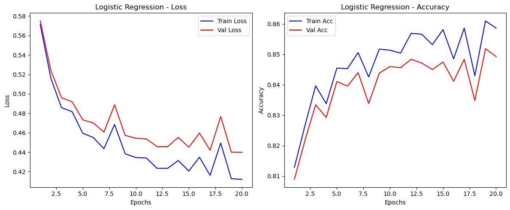
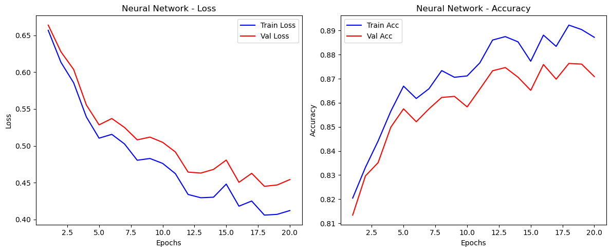

# Neural Network & Logistic Regression from Scratch (NumPy)

## Overview
This project implements a **Multi-Class Logistic Regression** classifier and a **2-Layer Neural Network** (MLP) entirely from scratch using **Python and NumPy**. The goal was to classify images from the **Fashion-MNIST** dataset (10 categories) without relying on high-level frameworks like PyTorch or TensorFlow for the core algorithms.

## Key Features
* **Pure NumPy Implementation:** Manual implementation of matrix operations for forward and backward propagation.
* **Modular Architecture:**
    * **Logistic Regression:** Linear classifier with Softmax activation.
    * **Neural Network:** Input (784) -> Hidden (128, ReLU) -> Output (10, Softmax).
* **Optimization:** Mini-batch Gradient Descent with Backpropagation.
* **Regularization:** Implemented L2 Regularization to prevent overfitting.
* **Preprocessing:** Data normalization (0-1 scaling) and One-Hot Encoding for labels.

## Performance
The models were trained for 20 epochs with a batch size of 128 and a learning rate of 0.1.
* **Logistic Regression Accuracy:** 84.93%
* **Neural Network Accuracy:** 87.09%

The Neural Network consistently outperformed the linear baseline, confirming the non-linear nature of the image data.

## Visualizations
### Logistic Regression Performance

### Neural Network Performance


## How to Run
1.  Install dependencies:
    ```bash
    pip install -r requirements.txt
    ```
2.  Ensure `train.csv` and `test.csv` (Fashion-MNIST) are in the root directory.
3.  Run the training script:
    ```bash
    python main.py
    ```
